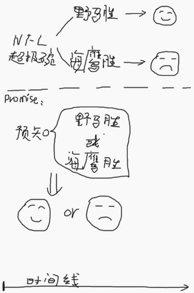
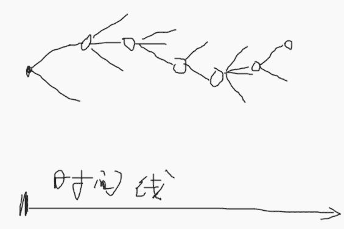
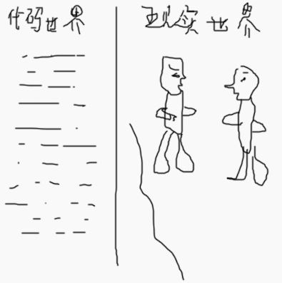
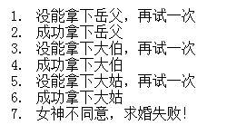
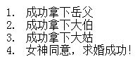
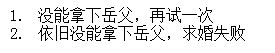
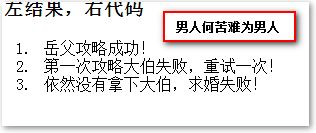
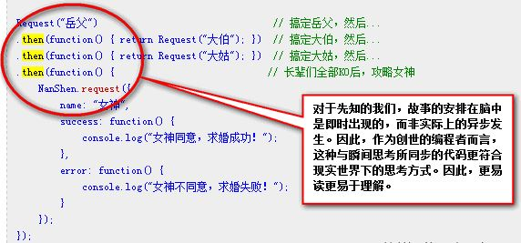
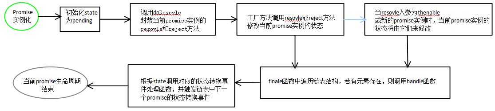

## 关于JavaScript的Promises【整理】

### 1.关于Promises
Promises很酷么？当然！它代表着编程的未来？绝对！既然这么多酷孩子都在使用它，但它为什么会这么特别？我在异步中不是可以直接使用回调么？有啥了不起的？

Promises/A规范是由CommonJS组织制定的异步模式编程规范，有不少库已经根据该规范以及后来制定的Promises/A+规范提供了实现，例如：

	Q, Bluebird, when, rsvp.js, mmDeferred, jQuery.Deffered()
虽然上边的实现都是Promises/A+规范作为实现基础，但由于Promises/A+是对Promises/A规范的改进和增强，因此深入学习Promises/A规范是必须的，本文就详细阐述Promises规范。 参考链接：
 [Promisejs官方站点](https://www.promisejs.org/)
 [Promises/A的Wiki](http://wiki.commonjs.org/wiki/Promises/A)
 Promises被逐渐用作一种管理异步操作回调的方法，但出于它们的设计，它们远比这个初衷的实用价值强，先看看Promises能做什么？

* 一个promise是一个对象——根据Promise/A规范——只需要一个方法：then。then方法带有三个参数：一个成功回调、一个失败回调、和一个前进回调（规范没有要求包括前进回调的实现，但是很多都实现了），一个全新的promise对象从每个then的调用中返回。
* 一个promise可以是三种状态之一：未完成的、完成的、或者失败的。promise以未完成的状态开始，如果成功它将会是完成态，如果失败将会是失败态。当一个promise移动到完成态，所有注册到它的成功回调将被调用，而且会将成功的结果值传给它。另外，任何注册到promise的成功回调，将会在它已经完成以后立即被调用。
* 同样的事情发生在promise移动到失败态的时候，除了它调用的是失败回调而不是成功回调。对包含前进特性的实现来说，promise在它离开未完成状态以前的任何时刻，都可以更新它的progress。当progress被更新，所有的前进回调(progress callbacks)会被传递以progress的值，并被立即调用。前进回调被以不同于成功和失败回调的方式处理；如果你在一个progress更新已经发生以后注册了一个前进回调，新的前进回调只会在它被注册以后被已更新的progress调用。

### 2.痛定思痛
JS中常见的异步调用方式是使用回调函数，优点是简单明了，但若实现：非连续移动的动画效果呢？看看下边的代码片段：

	var left = function(cb){
		el.style.left = (el.offsetLeft + 200) + 'px';
		cb && cb();
	};

	var el = document.getElementById('test');
	// 臭名远播的“回调地狱(callback hell)”
	setTimeout(function(){
		left(function(){
			setTimeout(function(){
				left(function(){
					setTimeout(function(){
						left();
					},2000);
				});
			}, 2000);
		});
	}, 2000);
上边就是JS中最著名的回调地狱，又称为“厄运金字塔”，这样的编程方式会大大降低代码的可读性，那么同样的功能如果使用Promises的方式实现会如何呢？

	var el = document.getElementById('test');
	// 定义thenable对象
	var thenable = {then: function(resolve, reject){
		setTimeout(function(){
    		el.style.left = (el.offsetLeft + 200) + 'px';
    		// 触发promise对象链中的下一个状态为pending的promise对象的状态变为fulfilled
    		resolve && resolve(); 
		}, 2000);
	}};
	// 将thenable对象封装为promise对象
	var promise = Promise.resolve(thenable);
	// 订阅promise对象状态变化时所触发的事件
	promise
		.then(function(){
			return thenable;
		})
		.then(function(){
			return thenable;
		});
上边只是两次非连续移动的代码，如果是10次？20次？如果使用回调的方式就不知道代码需要有多少缩进才能完成了，但若使用Promises/A的方式就变得简单了：

	var el = document.getElementById('test');
	var thenable = {then: function(resolve, reject){
		setTimeout(function(){
			el.style.left = (el.offsetLeft + 200) + 'px';
			resolve && resolve();
		}, 2000);
	}};
	var promise = Promise.resolve(thenable);
	var i = 0, count = 10;
	while (++i < 10){
		promise = promise.then(function(){
     		return thenable;
		});
	}
好吧，到此为止，我们已经到“地狱”中走了一圈，也初见了，那么接下来继续看看Promises为什么会是异步模式中的福音？

### 3.感性认识
通过上边的代码已经了解了Promise可以让我们使用不同的方式编写异步代码，但也仅仅停留在按形式套用代码的层面，只有从感性出发理解Promise的思想才能更好地掌握。

#### 3.1.Promise是一种形式
`Promise是一种形式`，也就是不要把Promise看成是某些方法、函数之类的，类似于：`不要把“小姐”看成某个人，而是某种职业。`

Promise中文有“誓言”，“承诺”之意，从字面意思可以体会出一点“形式”的味道，但是（注意转折），根据自己的理解，Promise完全不能按照“承诺”来理解，而是要根据其音译——“普罗米修斯”来理解，普罗米修斯是吸纳神话故事中的英雄，名字的意思是“先知”，Promise最初的命名是Futures，“未来”——可见Promise含义不是字面的“誓言”、“承诺”之类，而是“先知”、“未来”的意思。

那该如何去理解“先知”，JS与先知有什么关系？
 我们都知道，JS是单线程的，也就是一条线下来的，这是代码世界的一条规则，那么现实世界与之呼应的吗？——人？No，人是多线程的，人可以一边看动作片，一边撸智深，那是什么东西呢？啊哈，没错，有个东西是单线程的——时间，现实世界里，时间这条线是唯一的单线程，不会出现两条时间线，这种事是会出现在科幻故事里。
 人当下所经历的现实世界中，很多行为结果是未知的，不是即时呈现的。例如：NFL超级碗，巨星曼宁率领的野马队与本赛季黑马海鹰队的比赛。这实际上是个异步的过程，某明星压了1000万赌注野马队赢，比赛的结果会影响这位明星状态。这就类似于JS中发送一个异步的Ajax请求，不同的返回值造成不同的影响。

而Promise则扮演了一个“先知”的角色，预先将你的未来告知，规划好你继续的路，你无需等待最终结果出来，你可以继续你现在的生活，用简单的图来描述就是下边这样： 
 
如果你是一个先知，你是没有等待、异步的这种感觉的，这就是Promise的作用，一种“先知”的形式，好比上帝，已经在他的时间维度的一瞬间规划好你的一生（因为他有先知的能力，他无需跟着你的时间），虽然你自己依然感受到了时间，以及各种变数。

对于JS代码而言，我们就是上帝，我们能够预知代码的走向，并规划好代码的人生。回到当下，正在电脑面前的我们，想想你会经历的事情，可能会是下边这种样子——沿着时间线，一种事情连着另外一件事，每件事情都有多种可能的发展： 
 
这就好比JS世界中的异步操作，例如Ajax请求，现实世界中，大部分的操作结果都不是即时显现的（类似Ajax操作），如果用JS表示人的一生，那就会是一个超级无限长的嵌套。实际上，无限的嵌套更符合我们当下所感受的世界的理解，既然如此，为何写代码的时候不喜欢一堆嵌套呢？很简单，写代码的时候，我们是以上帝身份来处理代码的，我们就是造物主，而不是以代码中的角色身份，目前的JS异步回调就是按照代码视觉——随着时间推移，代码中的人和物会经历什么。那如何改变成先知视觉呢？ 

*很简单！使用Promise，而这就是Promise出现的意义：__将异步操作转换成更符合先知视觉的形式展现！__*

#### 3.2.Promise：更符合现实世界的直觉认知
我们之于代码为先知，如果我们知晓某一个现实世界故事发展走向，其实我们也是先知，因此，很多时候，除了自己正在经历的未知经历，我们可以使用Promise将现实世界映射。参考一下作者的原始文章：

【补充】

[关于一个JS功能实现的思维方式](http://www.zhangxinxu.com/wordpress/2011/10/js%E7%AE%97%E6%B3%95%E4%B8%8E%E6%80%9D%E7%BB%B4%E6%96%B9%E5%BC%8F/)，这篇文章站在代码的层面，脱离现实世界的思维方式，以空间换时间来更简单实现需要的效果。

Promise实际上与这个是类似，也可以说是一种思维方式的转变，Promise似乎能更好地映射现实世界，使事情得发展更加符合我们得直觉。 
 
这里讲一个故事吧：

	男神觉得时机成熟了，捧着99朵披着月季的玫瑰向女神求婚：
	“小妞妞，嫁给我吧！我发誓，我会对你好一辈子的！”
	“这个嘛，你先去问问我爸爸，我大伯以及我大姑的意思，他们全部都认可你，我再考虑考虑！
	对了，如果我爸没有答复，大伯他们肯定是不会同意的；如果大伯没有答复，大姑也是不会同意的。”

如果你是男神，你会怎么做？

看看步骤：

1. 买些好烟好酒登门拜访岳父大人，恳请岳父大人把女儿许配给自己；1日后，得到岳父答复，如果同意，攻略大伯；如果不同意，继续攻略1次，要是还不行，失败告终；
2. 同上攻略大伯；
3. 买上等化妆品，然后同上攻略大姑；
4. 拿着满满的offer拿下女神。

这是我们现实世界思维方式下的直觉反应，很简单的，也很好懂，但是如果使用目前的JS怎么实现呢？

因为长辈同意需要等待，而且一次只能攻略一个长辈，而且还能重复攻略，如果使用当下的JS去套用现实逻辑，可能就会这样子（无需细看）：

	男神.请求({
		姓名: "岳父",
		成功: 男神.继续请求({
		姓名: "大伯",
    	成功: 男神.继续请求({
            姓名: "大姑",
            成功: 男神.最终请求({
                姓名: "女神",
                成功: "求婚成功",
                失败: "求婚失败"
            }),
            失败: 男神.继续请求({
                姓名: "大姑",
                成功: 男神.最终请求({
                    姓名: "女神",
                    成功: "求婚成功",
                    失败: "求婚失败"
                }),
                失败: "求婚失败"
            })
        }),
        失败: 男神.继续请求({
            姓名: "大伯",
            成功: 男神.继续请求({
                姓名: "大姑",
                成功: 男神.最终请求({
                    姓名: "女神",
                    成功: "求婚成功",
                    失败: "求婚失败"
                }),
                失败: 男神.继续请求({
                    姓名: "大姑",
                    成功: 男神.最终请求({
                        姓名: "女神",
                        成功: "求婚成功",
                        失败: "求婚失败"
                    }),
                    失败: "求婚失败"
                })
            }),
            失败: "求婚失败"
        })
    }),
    失败: 男神.请求({
        姓名: "岳父",
        成功: 男神.继续请求({
            姓名: "大伯",
            成功: 男神.继续请求({
                姓名: "大姑",
                成功: 男神.最终请求({
                    姓名: "女神",
                    成功: "求婚成功",
                    失败: "求婚失败"
                }),
                失败: 男神.继续请求({
                    姓名: "大姑",
                    成功: 男神.最终请求({
                        姓名: "女神",
                        成功: "求婚成功",
                        失败: "求婚失败"
                    }),
                    失败: "求婚失败"
                })
            }),
            失败: 男神.继续请求({
                姓名: "大伯",
                成功: 男神.继续请求({
                    姓名: "大姑",
                    成功: 男神.最终请求({
                        姓名: "女神",
                        成功: "求婚成功",
                        失败: "求婚失败"
                    }),
                    失败: 男神.继续请求({
                        姓名: "大姑",
                        成功: 男神.最终请求({
                            姓名: "女神",
                            成功: "求婚成功",
                            失败: "求婚失败"
                        }),
                        失败: "求婚失败"
                    })
                }),
                失败: "求婚失败"
            })
        }),
        失败: "求婚失败"
    })
看了上边的代码过后，瞬间就晕了！为何按照现实思维，JS呈现的会这么复杂呢？

1. 代码需要预先设置好未来要发生的事情（先知视觉）；但是现实世界并不会如此（经历者视觉）；
2. 代码中，空间是稀缺资源，而现实世界中，时间也是；

因此，在传统的JS中，类似这种多嵌套，多异步，多发展的，我们需要牺牲（对于程序来讲）微不足道的时间换取代码的空间和可维护性，于是，我可能就会这么实现（无需细看）：

	var NanShen = {
    	"身高": 180,
    	"体重": 80,
    	"年薪": "200K",
    	request: function(obj) {
        	// 攻略长辈成功与否随机决定
        	// 成功概率为80%
        	if (Math.random() > 0.2) {
            	obj.success();
        	} else {
            	obj.error();
        	}
    	}
	};
	var Request = function(names, success) {
    	var index = 0, first = 0;
    	var request = function() {
        	if (names[index]) {
        	    NanShen.request({
        	        name: names[index],
        	        success: function() {
        	            first = 0;
        	            console.log("成功拿下" + names[index]);
        	            index++;
        	            request();
        	        },
        	        error: function() {
        	            if (first == 1) {
        	                console.log("依旧没能拿下" + names[index] + "，求婚失败");    
        	                return;
        	            } else {
        	                console.log("没能拿下" + names[index] + "，再试一次");    
        	            }
        	            first = 1;
        	            request();    
        	        }
        	    });    
       		} else {
            	success();
        	}
    	};    
		request();
	};
	Request(["岳父", "大伯", "大姑"], function() {
    	NanShen.request({
    	    name: "女神",
    	    success: function() {
    	        console.log("女神同意，求婚成功！");
    	    },
    	    error: function() {
    	        console.log("女神不同意，求婚失败！");
    	    }
    	});
	});
上边的代码通过异步回调，有效利用了JS代码，实现了男神的求婚过程。 
结果1： 
 
结果2： 
 
结果3： 
 
当然不能因为主角是Promise就后此薄彼，上边的JS实现是很赞的，以一种带有Promise的味道将多条件多异步的复杂世界用JS呈现出来，也是一种很巧妙的形式形式转化，套个噱头应该可以叫做`XXX模式`，啧啧啧~~

然后，上面方法，依次执行的触发依然在回调中，其实并不符合我们现实的思考，我们可能希望得到的代码具有如下与现实世界统一的思维：`搞定岳父 -> 搞定大伯 -> 搞定大姑 -> 搞定女神`，但是，上面的实现却看不出这样的思维，而Promise出现过后代码呈现会更符合真实世界的直觉。在这个故事里，女神其实已经把故事的走向告诉你了，这样的情况下，我们其实已经知晓了未来，我们已然是先知了，显然使用Promise是可行的。

看看Promise的代码：

	// 男神的各项参数
	var NanShen = {
    	"身高": 180,
    	"体重": 80,
		"年薪": "200K",
    	request: function(obj) {
        	// 成功与否随机决定
        	// 执行成功的概率为80%
        	if (Math.random() > 0.2) {
            	obj.success();
        	} else {
            	obj.error();
        	}
    	}
	};

	var Request = function(name) {
    	return new Promise(function(resolve, reject) {
        	var failed = 0, request = function() {            
            	NanShen.request({
                	name: name,
                	success: function() {
                    	console.log(name + "攻略成功！");
                   		failed = 0;
                    	resolve();
                	},
                	error: function() {
                    	if (failed == 0) {
                        	console.log("第一次攻略" + name + "失败，重试一次！");
                        	failed = 1;
                        	// 重新攻略一次
                        	request();                       
                    	} else {
                        	console.log("依然没有拿下" + name + "，求婚失败！");
                        	reject();
                    	}
                	}
            	});
        	};
        	request();
    	});
	};

	Request("岳父")                                			// 搞定岳父，然后...
		.then(function() { return Request("大伯"); })  		// 搞定大伯，然后...
		.then(function() { return Request("大姑"); })  		// 搞定大姑，然后...
		.then(function() {                            		// 长辈们全部KO后，攻略女神
    	NanShen.request({
        	name: "女神",
        	success: function() {
            	console.log("女神同意，求婚成功！");
        	},
        	error: function() {
            	console.log("女神不同意，求婚失败！");
        	}
    	});
	});
一样的风格、一样的味道、一样的运行结果，比如这样死在大伯手中： 
 
从代码量上看和传统JS实现不分伯仲，但注意下边部分（来自原Blog）： 
 
上边截图的文字部分意思是：

*对于先知的我们，故事的安排在脑中是即时出现的，而非实际上的异步发生。因此，作为创世的编程者而言，这种与瞬间思考所同步的代码更符合现实世界下的思考方式。因此，更易读更易于理解。*

无论代码世界中的编程还是现实世界的讲故事，我们都是一个先知的角色（除非你能让机器自我学习，无法预知走向），都是Promise。

现实世界中，如果我们要讲一个故事，都是一瞬间在脑中知晓（没有异步，等待时间经历的过程），例如教授死了，炸鸡啤酒女会哭得死去活来。在写代码逻辑的时候，脑中的反应是如此，一瞬间知晓的逻辑变化如下：

	if(JiaoShou == "dead"){
		crying~~~~
	}
这就属于先知，因此，我们更乐意看到符合人类瞬间思维的代码呈现，而不是符合实际发展的代码呈现。先知思维的代码呈现就是Promise形式，当局者思维的代码呈现就是异步回调模式。

如果套用前边的求婚的例子，则：

* 先知思维（第三人称视觉） `搞定岳父 -> 搞定大伯 -> 搞定大姑 -> 搞定女神`
* 当局者思维（第一称视觉） `去搞定岳父 -> ...等待结果... -> 去搞定大伯 -> ...等待结果... -> 去搞定大姑 -> ...等待结果... -> 去搞定女神 -> ...等待宣判...`

前者是上帝视觉（先知），在规划；后者是凡人视觉，在经历；Coding以及讲故事都属于规划，因此，__Promise这种先知形式会让代码更符合人类的认知__，说白了就是更好理解，更好维护，可以怎么想就怎么写，而无需写着写着发现需要再嵌套一个回调函数。

看完了上边部分的【补充】，再回到Promise上来，继续走先知的路，看看生活中的另外一个例子：

	例子：下班搭车去接小孩回家。
直觉思维上分析会得出下边的任务顺序：`下班 -> 搭车 -> 到幼儿园（小学等）接小孩 -> （走路）回家`，可踹看到这种思维方式是__任务 + 执行顺序__的，丝毫没有带__任务间的时间距离__，于是同步代码可以写成：

	var 下班 = function(){};
	var 搭车 = function(){};
	var 接小孩 = function(){};
	var 回家 = function(){};

	下班();
	搭车();
	接小孩();
	回家();
但实际执行时各个任务均有可能因某种原因出现不同程度的延时，如下班时老板安排一项新任务（推迟10分钟），错过班车（下一班要等10分钟），小孩正在搞卫生（20分钟搞完），回家。真实生活中我们能做的就是干等或做点其他的事过后再执行流程！但程序中尤其是像JS单线程这种任务是“等”不起的，于是出现了异步模式：

	var 下班 = function(nextTask){};
	var 搭车 = function(nextTask){};
	var 接小孩 = function(nextTask){};
	var 回家 = function(nextTask){};

	下班(function(){
		setTimeout(function(){
    		搭车(function(){
       			setTimeout(function(){
         			接小孩(function(){
           				setTimeout(function(){
             				回家(); 
           				},  20*60*1000);
         			});
       			},  10*60*1000);
    		});
		}, 10*60*1000);
	});
上边的代码就是出现了等待过后的代码段，然后就发现整个流程被任务间的时间距离拉得很远：`下班---------搭车---------接小孩---------------------回家`。回想一下真实生活中即使执行每个任务时均需要等待，但整个流程的抽象也只能是：`下边、等、搭班车、等，接小孩，等，回家`。因此回调函数的异步模式与我们的思维模式相距甚远，那么如何做到即告诉程序任务间的时间距离，又从代码结构上淡化这种时间距离感呢？而Promise就是其中一种方式了！

从开发者角度（第三人称）看来Promise作为任务间的纽带存在，流程抽象为：`下班，promise，搭车，promise，接小孩，promise，回家`，而任务间的时间距离则归并到任务本身而已，从程序执行角度（第一人称）来看Promise为一个待定变量，但结果仅有两种——成功和失败，于是仅对待定变量设定两种结果的处理方式即可。那么看看Promise的平行代码：

	// 任务定义部分
	var 下班 = function(){};
	下班.then = function(resovle){ 
		setTimeout(function(){
    		resovle();
		}, 10*60*1000);
	};
	var 搭车 = function(){};
	搭车.then = function(resovle){ 
		setTimeout(function(){
    		resovle();
		}, 10*60*1000);
	};
	var 接小孩 = function(){};
	接小孩.then = function(resovle){ 
		setTimeout(function(){
    		resovle();
		}, 20*60*1000);
	};
	var 回家 = function(){};

	// 流程部分
	var p = new Promise(function(resolve, reject){
		resolve();
	});
	p.then(function(){
		下班();
		return 下班;
	})
	.then(function(){
		搭车();
		return 搭车;
	})
	.then(function(){
		接小孩();
		return 接小孩;
	})
	.then(function(){
		回家();
	});
上边的代码在Promise的魔法下成了平行代码，但代码结构的变化是表象，最根本的是任务间的时间距离被淡化了，当我们想了解工作流程时不会被时间距离分散注意力，当我们想知道各个任务的延时之需查看任务本身定义就可以了，这就是关注点分离的一种表现。

### 4.Promises/A的API规范
Promise表示一个异步操作的最终结果，与Promise进行交互的主要方式是通过`then`方法，该方法注册了两个回调函数，用于接受Promise的最终结果或者Promise的据因。

本文规范详细列出了`then`方法的行为，所有遵循Promises/A+规范实现的Promise均可参照这个标准实现`then`方法，故而提供提供了一个可互操作的基础。因此，本规范可以被认为是十分稳定的，尽管Promises/A+组织可能有时会修订本规范，造成微小的、向下兼容的改变以解决新发现的一些边界值，但我们仅仅在慎重考虑、详细讨论和严格测试之后才会进行在大规模或向下不兼容的集成。

从历史上说，Promises/A+规范将之前Promises/A规范的建议明确为了行为标准，其扩展了元规范以覆盖一些约定俗成的行为，以及省略掉一些仅在特定情况下存在的或者有问题的部分。

最后，核心的Promises/A+规范不设计如何建立、执行、拒绝Promises，而是专注于提供一个可互操作的`then`方法，上述对Promises的操作方法将来在其他规范中可能会触及。

#### 4.1.术语

* *promise*是一个拥有`then`方法的对象或函数，其行为符号本规范；
* *thenable*是一个定义`then`方法的对象或函数；
* 值（*value*）是指任何JavaScript的合法值（包括`undefined`，*thenable*和*promise*）；
* 异常（*exception*）是使用`throw`语句抛出的一个值；
* 据因（*reason*）是一个值以表明为何一个*promise*会被拒绝；

#### 4.2.要求

__Promise的状态__

一个Promise必须处于__等待态（Pending）、执行态（Fulfilled）、拒绝态（Rejected）__这三种状态中的一种之中。

1. 处于__等待态__时，*promise*：
	* 可以迁移至__执行态__或__拒绝态__
2. 处于__执行态__时，*promise*：
	* 不能迁移至其他任何状态；
	* 必须拥有一个不可变的__值__；
3. 处于__拒绝态__时，*promise*：
	* 不能迁移至其他任何状态；
	* 必须拥有一个不可变的__据因__；
这里的__不可变__指的是恒等（即可使用`===`判断相等），而不是意味着更深层次的不可变。

__Then方法__

一个*promise*必须提供一个`then`方法以访问其当前值，最终返回值和据因。

*promise*的`then`方法接受两个参数：

	promise.then(onFulfilled, onRejected)

1. `onFulfilled`和`onRejected`都是可选参数
	* 如果`onFulfilled`不是函数，其必须被忽略
	* 如果`onRejected`不是函数，其必须被忽略
2. 如果`onFulfilled`是函数
	* 当`promise`执行结束后其必须被调用，其第一个参数为`promise`的值
	* 在`promise`执行结束前期不可被调用
	* 其调用次数不可超过一次
3. 如果`onRejected`是函数
	* 当`promise`被拒绝执行后其必须被调用，其第一个参数为`promise`的据因
	* 在`promise`被拒绝执行前期不可被调用
	* 其调用次数不可超过一次
4. `onFulfilled`和`onRejected`直到执行环境堆栈尽包含平台代码前不可被调用[注1]
5. `onFulfilled`和`onRejected`必须作为函数调用（即没有`this`值）[注2]
6. `then`方法可以被同一个`promise`调用多次
	* 当`promise`成功执行时，所有`onFulfilled`需按其注册顺序依次回调
	* 当`promise`被拒绝执行时，所有`onRejected`需按照其注册顺序依次回调
7. `then`方法必须返回一个`promise`对象[注3]
		
		promise2 = promise1.then(onFulfilled,onRejected);
	* 如果`onFulfilled`或者`onRejected`返回一个值`x`，则运行下面的__Promise解决程序__：`[[Resolve]](promise2, x)`
	* 如果`onFulfilled`或者`onRejected`抛出一个异常`e`，则`promise2`必须拒绝执行，并返回拒因`e`
	* 如果`onFulfilled`不是函数且`promise1`成功执行，`promise2`必须成功执行并返回相同的值
	* 如果`onRejected`不是函数且`promise1`拒绝执行，`promise2`必须拒绝执行并返回相同的据因

__Promise解决程序__

__Promise解决程序__是一个抽象的操作，其需输入一个*promise*和一个值，我们表示为`[[Resolve]](promise,x)`，如果`x`是*thenable*的，同时若`x`至少满足和`promise`类似（即鸭子类型，`x`拥有部分或全部`promise`拥有的方法属性）的前提，解决程序即尝试使`promise`接受`x`的状态；否则其用`x`的值来执行`promise`。

这种对*thenable*的操作允许*promise*实现互操作，只要其暴露出一个遵循Promise/A+协议的`then`方法。

运行`[[Resolve]](promise,x)`需要遵循以下的步骤：

1. 如果`promise`和`x`指向同一对象，以`TypeError`为据因拒绝执行`promise`
2. 如果`x`为`promise`，接受其状态[注4]
	* 如果`x`处于等待态，`promise`需保持为等待态直至`x`被执行或拒绝
	* 如果`x`处于执行态，用相同的值执行`promise`
	* 如果`x`处于拒绝态，用相同的据因执行`promise`
3. 抑或`x`为对象或者函数：
	* 设置`then`方法为`x.then`[注5]
	* 如果取`x.then`的返回值时抛出错误`e`，则以`e`为据因拒绝`promise`
	* 如果`then`是函数，将`x`作为函数的作用域`this`调用之，其第一个参数为`resolvePromise`，第二个参数为`rejectPromise`：
		* 如果`resolvePromise`以值`y`为参数被调用，则运行`[[Resolve]](promise,y)`
		* 如果`rejectPromise`以据因`r`为参数被调用，则以据因`r`拒绝`promise`
		* 如果`resolvePromise`和`rejectPromise`均被调用，或者被同一参数调用了多次，则优先采用首次调用和忽略剩下的调用
		* 如果调用`then`方法抛出了异常`e`：
			* 如果`resolvePromise`或`rejectPromise`已经被调用，则忽略之
			* 否则以`e`为据因拒绝`promise`
		* 如果`then`不是函数，以`x`为参数执行`promise`
	* 如果`x`不为对象或者函数，以`x`为参数执行`promise`

如果一个*promise*被一个循环的*thenable*链中的对象解决，而`[[Resolve]](promise, thenable)`的递归性质又使得其被再次调用，根据上述的算法将会陷入无限递归之中。算法不强制要求，但鼓励其实施者以检测这样的递归是否存在，若存在则以一个可识别的`TypeError`为据因来拒绝`promise`。[注6]

#### 4.3.注释
* 注1：这里的__平台代码__指的是引擎、环境以及_promise_的实施代码。实践中要确保`onFulfilled`和`onRejected`在`then`方法被调用后的事件循环中异步执行和一个全新的堆栈。这可以用一个“宏任务”机制（如`setTimeout`或`setImmediate`）或者“微任务”机制（如`MutationObserver`或`process.nextTick`）来实现。由于*promise*的实施代码本身就是平台代码，故其自身可以包含一个任务调度队列或者在处理程序被调用时的“蹦床”。
* 注2：也就是说在__严格模式（strict）__中，函数`this`的值为`undefined`；在非严格模式中其为全局对象。
* 注3：代码实现在满足所有要求的情况下可以允许`promise2 === promise1`。每个实现都要文档说明其是否允许以及在何种条件下允许`promise2 === promise1`。
* 注4：总体来说，其只会知道`x`是真正的*promise*如果其来自当前实施。此标准允许使用特殊的实现方式以接受符合已知要求的*promises*状态。
* 注5：这一步是存储一个指向`x.then`的引用，然后测试该引用，然后调用该引用。以避免多次访问`x.then`属性。这种预防措施在确保可访问属性的一致性上非常重要，因为其值可能在返回时被改变。
* 注6：实现不应该对*thenable*链的深度设限，并假定超出本限制的递归就是无限循环。只有真正的循环递归才应能导致`TypeError`异常；如果一条无限长的链上*thenable*均不相同，那么递归下去永远是正确的行为。

#### 4.4.使用

从上边的解释中可以知道，Promise其实是一个有限状态机，包含三种状态：

##### 4.4.1.有限状态机

* `Pending`：等待态
* `Fulfilled`：执行态
* `Rejected`：拒绝态

但实际上状态迁移转换关系只有两种：

* `Pending -> Fulfilled`（事件执行成功）
* `Pending -> Rejected`（事件执行失败）

##### 4.4.2.构造函数

	Promise({Function} factory /*({Function} resolve,{Function} reject)*/ )
构造函数存在一个Function类型的入参`factory`，作为唯一一个修改promise对象状态的地方，其中`factory`函数的入参`resolve`的作用是将`promise`对象的状态从`pending`转换成`fulfilled`，而`reject`的作用就是将`promise`对象的状态从`pending`转换成`rejected`。

* `void resolve({Any} val)`，当val为非thenable对象和promise对象则会将val作为执行成功事件处理函数的入参，若val为`thenable`对象时则会执行`thenable.then`方法，若val为`promise`对象时则会将该Promise对象添加到Promise对象单向链表中。
* `void reject({Any} reason)`，`reason`不管是哪种内容均直接作为执行失败事件处理函数的入参。

注意：关于抛异常的做法， 1.同步模式为`throw new Error("I'm synchronous way!")`; 2.Promise规范的做法是`reject(new Error("I'm asynchronous way!"));`

##### 4.4.3.实例方法

	Promise then([{Function} onFulfilled[, {Function} onRejected]])
用于订阅Promise对象状态转换事件，入参`onFulfilled`为执行成功的事件处理函数，入参`onRejected`为执行失败的事件处理函数，两者的返回值均作为Promise对象单向链表中下一个Promise对象的状态转换事件处理函数的入参，而`then`方法的返回值是一个新的Promise对象并且已添加到Promise对象单向链表的末尾。 
`Promise catch({Function} onRejected)`，相当于`then(null,onRejected)`。

##### 4.4.4.类方法

* 用于将非Promise类型的入参封装为Promise对象，若obj为非thenable对象则返回状态为fulfilled的Promise对象，对于非若入参为Promise对象则直接返回；

		Promise Promise.resolve({Any} obj)
* 用于将非Promise类型的入参封装为状态为rejected的Promise对象；

		Promise Promise.reject({Any} obj)
* 当array中所有Promise实例的状态均为fulfilled时，该方法返回的Promise对象的状态也转为fulfilled（执行成功事件处理函数的入参为array数组中所有Promise实例执行成功事件处理函数的返回值），否则转换为rejected；

		Promise Promise.all({Array} array)
* 当array中所有Promise实例的状态出现fulfilled时，该方法返回的Promise对象的状态也转为fulfilled（执行成功事件处理函数的入参为状态为fulfilled的Promise实例执行成功事件处理函数的返回值），否则转换为rejected；

		Promise Promise.race({Array} array)

##### 4.4.5.thenable对象
拥有`then`方法的对象均称为thenable对象，并且thenable对象将作为Promise对象被处理。

#### 4.5.示例
了解了Promise/A规范的特性过后，再看看对应的示例：

实例一：链式操作——执行最近的事件处理函数

	// 创建Promise实例p1	
	var p1 = new Promise(function(resovle, reject){
		setTimout(function(){
    		console.log('hello1');
    		// 1秒后修改promise实例的状态为fulfilled
    		resolve('hello1');
		},1000);
	});
	// 订阅p1的执行成功事件处理函数，并创建Promise实例p2
	// 该处理函数将立即返回结果
	var p2 = p1.then(function(val){
		var newVal = 'hello2';
		console.log(val);
		console.log(newVal);
		return newVal;
	});
	// 订阅p2的执行成功事件处理函数，并创建Promise实例p3
	// 该处理函数返回一个Promise实例，并1秒后该Promise实例的状态转换为rejected
	var p3 = p2.then(function(val){
		console.log(val);
		var tmp = new Promise(function(resolve, reject){
			setTimout(function(){
				reject(new Error('my error!'));
			}, 1000);
		});
		return tmp;
	});
	// 订阅p3的执行成功事件处理函数，并创建Promise实例p4
	// 由于p2的处理函数所返回的Promise实例状态为rejected，因此p3的执行成功事件处理函数将不被执行，
	// 并且p3没有执行失败事件处理函数，因此会将控制权往下传递给p4的执行失败事件处理函数。
	var p4 = p3.then(function(val){
		console.log('skip');
	});
	//  订阅p4的执行成功事件处理函数，并创建Promise实例p5
	var p5 = p4.catch(function(reason){
		console.log(reason);
	});
上边的代码输出信息为：

	hello1     hello1    hello2    hello2    error:my error!

实例二：事件处理函数晚绑定，同样可被触发

	var p1 = new Promise(function(resolve, reject){
		resolve('hello');
	});
	// Promise实例p1状态转换为fulfilled一秒后才绑定事件处理函数
	setTimeout(function(){
		p1.then(function(val){
    		console.log(val);
		});
	}, 1000);
上边的输出信息为：

	hello

### 5.官方源代码剖析
由于Promises/A规范实际仅提供接口定义，并没有规定具体实现细节，因此我们可以先自行作实现方式的猜想。上述的示例一表明Promise是具有链式操作，因此Promise内部结构应该是一个单向链表结构，每个节点除了自身数据外，还有一个字段用于指向下一个Promise实例。

构造函数具体实现可以是这样（非官方的实现）：

	var Promise = exports.Promise = function(fn){
		if (!(this instanceof iPromise))
			return new iPromise(fn);
		var _ = this._ = {};
		_.state = 0; // 0:pending, 1:fulfilled, 2:rejected
		_.thenables = []; // 单向链表
		fn && fn(this.resolve.bind(this), this.reject.bind(this));
	};
而`then`函数的具体方式可以为（非官方）：

	Promise.prototype.then = function(fulfilledHandler, rejectedHandler){
		var _ = this._;
		var promise = new Promise();
		// 单向链表的逻辑结构
		var thenable = {
			onFulfilled: fulfilledHandler, // 执行成功的事件处理函数
			onRejected: rejectedHandler, // 执行失败的事件处理函数
			promise: promise // 下一个Promise实例
		};
		_.thenables.push(thenable);
		if (_.state !== 0){
			window[window.setImmediate ? 'setImmediate' : 'setTimeout'].call(window, function(){
				handle(_);
			}, 0);
		}
		return promise;
	};
上边为很简单的两个方法的具体实现部分的内容，但官方的实现部分比上边的复杂许多，接下来看看官方关于Promise部分的实现。

#### 5.1.基础功能部分
基础功能部分主要分为__构造函数__和**then函数的实现**两部分，而__then函数的实现__是理解的难点。

##### 5.1.1.构造函数

	var Promise = exports.Promise = function (fn) {
		if (typeof this !== "object") throw new TypeError("Promises must be constructed via new");
		if (typeof fn !== "function") throw new TypeError("not a function");
		var state = null; // 状态，null：pending，true：fulfilled，false：rejected
		var value = null; // 当前promise的状态事件处理函数（onFulfilled或onRejected）的入参
		var deferreds = []; // 当前promise的状态事件处理函数和promise链表中下一个promise的状态转换发起函数
		var self = this;
		// 唯一的公开方法
		this.then = function(onFulfilled, onRejected) {
			return new self.constructor(function(resolve, reject) {
				handle(new Handler(onFulfilled, onRejected, resolve, reject));
			});
		};
		// 保存和执行deferreds数组中的元素
		function handle(deferred) {
			if (state === null) {
				deferreds.push(deferred);
				return;
			}
			// asap的作用为将入参的操作压入event loop队列中
			asap(function() {
				var cb = state ? deferred.onFulfilled : deferred.onRejected;
				if (cb === null) {
					(state ? deferred.resolve : deferred.reject)(value);
					return;
				}
				var ret;
				try {
					// 执行当前promise的状态转换事件处理函数
					ret = cb(value);
				} catch (e) {
					// 修改promise链表中下一个promise对象的状态为rejected
					deferred.reject(e);
					return;
				}
				// 修改promise链表中下一个promise对象的状态为fulfilled
				deferred.resolve(ret);
			});
		}
		// promise的状态转换发起函数，触发promise的状态从pending->fulfilled
		function resolve(newValue) {
			try {
				if (newValue === self) throw new TypeError("A promise cannot be resolved with itself.");
				if (newValue && (typeof newValue === "object" || typeof newValue === "function")) {
					var then = newValue.then;
					if (typeof then === "function") {
						// 将控制权移交thenable和promise对象，由它们来设置当前pormise的状态和状态转换事件处理函数的实参
						doResolve(then.bind(newValue), resolve, reject);
						return;
					}
				}
				state = true;
				value = newValue;
				finale();
			} catch (e) {
				reject(e);
			}
		}
		// promise的状态转换发起函数，触发promise的状态从pending->rejected
		function reject(newValue) {
			state = false;
			value = newValue;
			finale();
		}
		// 向链表的下一个promise移动
		function finale() {
			for (var i = 0, len = deferreds.length; i < len; i++) handle(deferreds[i]);
			deferreds = null;
		}
		// 执行构造函数的工厂方法，由工厂方法触发promise的状态转换
		doResolve(fn, resolve, reject);
	}
上边的代码是官方的实现部分的代码，可通过：`new Promise(function(resolve,reject){ resolve('Hello'); });`来跟踪执行过程，实际其重点代码在`doResolve(fn,resolve,reject)`这个方法调用中，此方法的定义如下：

	// 对状态转换事件处理函数进行封装后，再传给执行函数
	function doResolve(fn, onFulfilled, onRejected) {
		// done作为开关以防止fn内同时调用resolve和reject方法
		var done = false;
		try {
			fn(function(value) {
				if (done) return;
				done = true;
				onFulfilled(value);
			}, function(reason) {
				if (done) return;
				done = true;
				onRejected(reason);
			});
		} catch (ex) {
			if (done) return;
			done = true;
			onRejected(ex);
		}
	}
doResolve仅仅是对resolve和reject方法进行封装以防止同时被调用的情况而已，这时控制权到达`resolve`方法，由于resolve的入参为字符串类型，因此直接修改成当前promise的状态和保存状态转换事件处理函数的实参即可（若resolve的入参为thenable对象或Promise对象，则将控制权交给该对象，由该对象来设置当前promise的状态和状态转换事件处理函数的实质），然后将控制权移交`finale`方法，finale方法内部会遍历deffereds数组并根据状态调用对应的处理函数和修改promise链表中下一个promise对象的状态。

这里引发了一个疑问：那么deffereds数组具体是什么呢？其实它就跟我之前猜想的thenables数组功能一致，用于保存状态转换事件处理函数和维护promise单向链表（不直接存放下一个promise对象的指针，而是存放下一个promise的resolve和reject方法），具体数据结构如下：

	// 构造promise的链表逻辑结构
	function Handler(onFulfilled, onRejected, resolve, reject) {
		this.onFulfilled = typeof onFulfilled === "function" ? onFulfilled : null; // 当前promise的状态转换事件处理函数
		this.onRejected = typeof onRejected === "function" ? onRejected : null; // 当前promise的状态转换事件处理函数
		this.resolve = resolve; // 设置链表中下一个promise的状态为fulfilled
		this.reject = reject; // 设置链表中下一个promise的状态为rejected
	}
若当前promise有defferred实例，那么则会执行handle函数中asap函数的函数入参

	function() {
		var cb = state ? deferred.onFulfilled : deferred.onRejected;
		if (cb === null) {
		　　 (state ? deferred.resolve : deferred.reject)(value);
		return;
		}
		var ret;
		try {
	　　  	// 执行当前promise的状态转换事件处理函数
			ret = cb(value);
		} catch (e) {
		　　 // 修改promise链表中下一个promise对象的状态为rejected
			deferred.reject(e);
			return;
		}
		// 修改promise链表中下一个promise对象的状态为fulfilled
		deferred.resolve(ret);
	}
实际上原来的实现方法这样看起来比较繁琐，看看整理过后的代码：

	function(){
		var cb = deferred[state ? 'onFulfilled' : 'onRejected'];
		var deferredAction = 'resolve', ret;
		try{
		　　ret = cb ? cb(value) : value;
		}
		catch (e){
		　　ret = e;
			deferredAction = 'reject';
		}
		deferred[deferredAction].call(deferred, ret);
	}
仅仅看代码无法详细解释里面的实现流程，看看下边的图：

接下来的问题就是deffereds数组的元素是从何而来？看看then函数的实现。
##### 5.1.2.then函数的实现
then函数代码结构上很简单，但设计上却十分精妙。

	this.then = function(onFulfilled, onRejected){
		return new self.constructor(function(resolve, reject) {
			handle(new Handler(onFulfilled, onRejected, resolve, reject));
		});
	}
为了好看些，加入对应的注释：

	this.then = function(onFulfilled, onRejected) {
		// 构造新的promise实例并返回，从而形成链式操作
		return new Promise(function(resolve, reject) {
			var handler = new Handler(onFulfilled, onRejected, resolve, reject);
	　　　　/*
			* 注意：这里利用了闭包特性，此处的handle并不是新Promise的handle函数，而是this.then所属promise的handle函数。
			* 因此handler将被添加到this.then所属promise的deffereds数组中。
			* 而onFulfilled和onRejected自然成为了this.then所属promise的状态转换事件处理函数，
			* 而resolve和reject依旧是新promise实例的状态转换触发函数。
			*/
			handle(handler);
		});
	};
实际上源代码通过闭包特性让链表后一个对象调用前一个对象的方法和变量，从而实现私有方法和属性比较过瘾，比起作者猜想的实现方式通过下划线(_)提示API调用者该属性下的均为私有成员的做法封装性更完整。

#### 5.2.辅助功能部分
辅助功能部分主要就是__Promise.resolve, Promise.reject, Promise.all, Promise.race__的实现，它们均由基础功能扩展而来。

##### 5.2.1.Promise.resolve实现
作用：将非Promise对象转换为Promise对象，而非Promise对象则被细分为两种：thenable对象和非thenable对象

* thenable对象的then将作为Promise构造函数的工厂方法别调用
* 非thenable对象（Number, DOMString, Boolean, null, undefined等）将作为`pending -> fulfilled`的事件处理函数的入参

由于源码中加入了性能优化的代码，所以提取核心逻辑来分析：

	// 将非thenable对象构造为thenable对象
	// 其then方法则返回一个真正的Promise对象
	function ValuePromise(value) {
	　　this.then = function(onFulfilled) {
		　　if (typeof onFulfilled !== "function") return this;
			return new Promise(function(resolve, reject) {
				asap(function() {
					try {
        　				resolve(onFulfilled(value));
         　　		} catch (ex) {
         　　　　		reject(ex);
					}
				});
			});
	　　 };
	}
	/*
	也可以将非thenable对象构造为Promise对象
	function ValuePromise(value){
	　　 return new Promise(function(resolve){
		　　 resolve(value);
		});
	}*/
	Promise.resolve = function(value) {
		if (value instanceof Promise) return value;
		if (typeof value === "object" || typeof value === "function") {
			try {
				var then = value.then;
				if (typeof then === "function") {
					return new Promise(then.bind(value));
				}
			} catch (ex) {
				return new Promise(function(resolve, reject) {
					reject(ex);
				});
			}
		}
		return new ValuePromise(value);
	};

##### 5.2.2.Promise.reject实现
作用：创建一个状态为rejected的Promise对象，且入参将作为onRejected函数的入参。

	Promise.reject = function(value) {
		return new Promise(function(resolve, reject) {
			reject(value);
		});
    };

##### 5.2.3.Promise.all实现
作用：返回的一个promise实例，且该实例当且仅当Promise.all入参数组中所有Promise元素状态均为fulfilled时该返回的promise实例的状态转换为fulfilled（onFulfilled事件处理函数的入参为处理结果数组），否则转换为rejected。

	Promise.all = function(arr) {
		var args = Array.prototype.slice.call(arr);
		return new Promise(function(resolve, reject) {
			if (args.length === 0) return resolve([]);
			var remaining = args.length;
			function res(i, val) {
				try {
					if (val && (typeof val === "object" || typeof val === "function")) {
						var then = val.then;
						if (typeof then === "function") {
							then.call(val, function(val) {
								// 对于thenable和promise对象则订阅onFulfilled事件获取处理结果值
								res(i, val);
							}, reject);
							return;
						}
					}
					args[i] = val;
					// 检测是否所有入参都已返回值
					if (--remaining === 0) {
						resolve(args);
					}
				} catch (ex) {
					reject(ex);
				}
			}
			for (var i = 0; i < args.length; i++) {
				res(i, args[i]);
			}
		});
	};

##### 5.2.4.Promise.race实现
作用：返回一个promise对象，且入参数组中一旦某个promise对象状态转换为fulfilled，则该promise对象的状态也转换为fulfilled。

	Promise.race = function(values) {
		return new Promise(function(resolve, reject) {
			values.forEach(function(value) {
				// 将数组元素转换为promise对象
				Promise.resolve(value).then(resolve, reject);
			});
		});
	};
源码实现的方式是即使第一个数组元素的状态已经为fulfilled，但仍然会订阅其他元素的onFulfilled和onRejected事件，依赖resolve函数中的标识位done来保证返回的promise对象的onFulfilled函数仅执行一次。稍稍修改一下如下：

	Promise.race = function(values){
		return new Promise(function(resolve, reject){
			var over = 0;
			for (var i = 0, len = values.length; i < len && !over; ++i){
				var val = values[i];
				if (val && typeof val.then === 'function'){
					val.then(function(res){
						!over++ && resolve(res);
					}, reject);
				}
				else{
					!over++ && resolve(val);
				}
			}
		});
	};
总结：到这里Promise的感性认识、基本介绍、原码剖析就差不多介绍完了。

