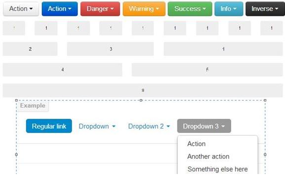
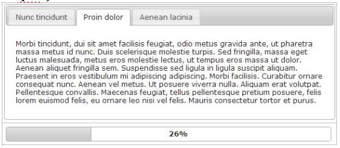
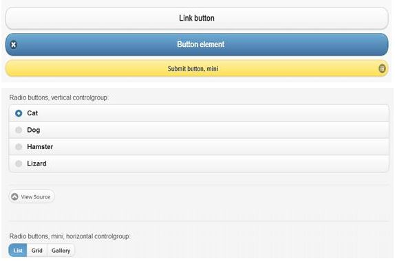
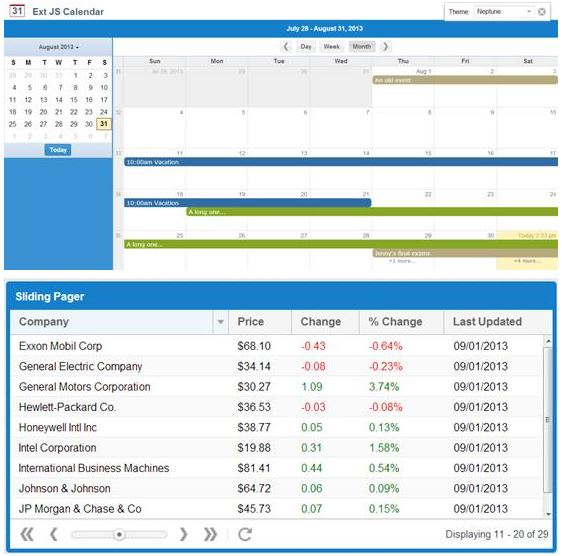
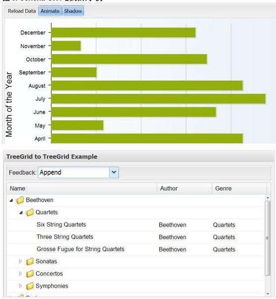
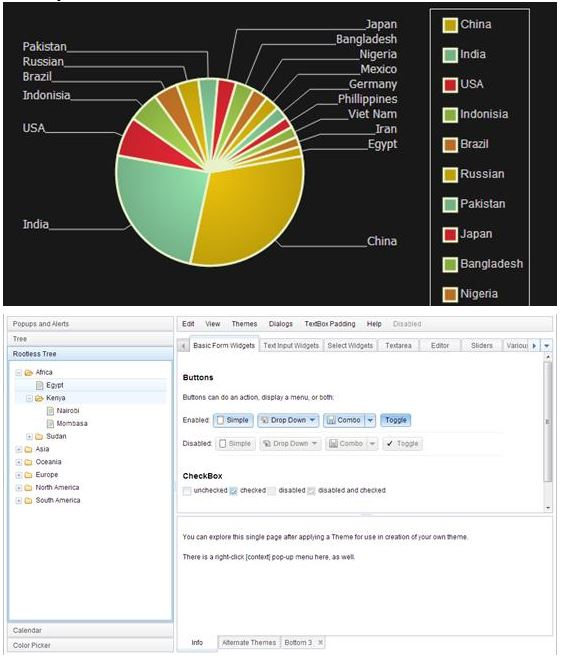
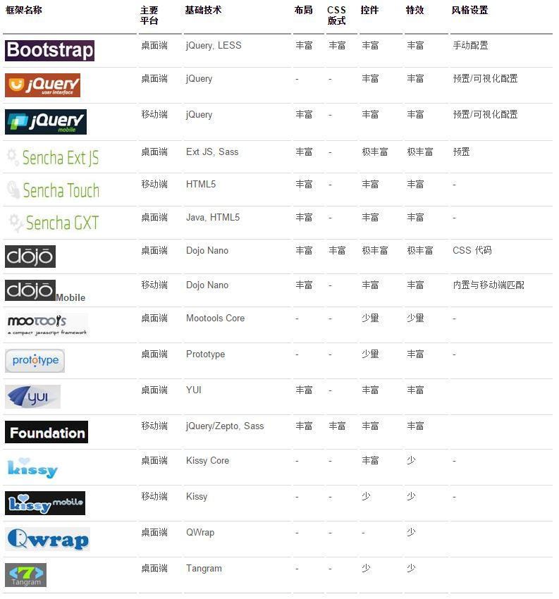

## 前端框架对比

引用地址：[http://www.ibm.com/developerworks/cn/web/1404_wangfx_jsframeworks/](http://www.ibm.com/developerworks/cn/web/1404\_wangfx\_jsframeworks/)

### 1.JavaScript & CSS

#### 1.1.JavaScript

目前主流的 JavaScript 框架排名中，jQuery 和 Ext 可算是佼佼者，获得了用户的广泛好评。国内的一些框架很多也是仿照 jQuery 对 JavaScript 进行了包装，不过这些框架的鼻祖 YUI 还是坚持用自己的 JavaScript 类库。

jQuery 是目前用的最多的前端 JavaScript 类库，据初步统计，目前 jQuery 的占有率已经超过 46%，它算是比较轻量级的类库，对 DOM 的操作也比较方便到位，支持的效果和控件也很多。同时，基于 jQuery 有很多扩展项目，包括 jQuery UI(jQuery 支持的一些控件和效果框架)、jQuery Mobile(移动端的 jQuery 框架)、QUnit(JavaScript 的测试框架)、Sizzle(CSS 的选择引擎)。这些补充使得 jQuery 框架更加完整，更令人兴奋的是，这些扩展与目前的框架基本都是兼容的，可以交叉使用，使得前端开发更加丰富。

Ext 是 Sencha 公司推崇的 JavaScript 类库，相比 jQuery，Ext JS 更重量级，动辄数兆的文件，使得 Ext 在外网使用的时候会顾虑很多。但是，另一方面，在 Ext JS 庞大的文件背后是 Ext JS 强大的功能。Ext JS 的控件和功能可以说强大和华丽到了让人发指的程度。图表、菜单、特效，Ext JS 的控件库非常丰富，同时它的交互也非常强大，独立靠 Ext JS 几乎就可以取代控制层完成于客户的交互。强大的功能，丰富的控件库，华丽的效果也使得 Ext JS 成为内网开发利器。

框架鼻祖 YUI 也有自己的 JavaScript 类库，DOM 操作和效果处理也还比较方便，功能和控件也很齐全，但是相比 jQuery 和 Ext JS 显得比较中庸一些。随着 Yahoo!的没落，YUI 的呼声也逐渐被新起的框架淹没，想来也让人惋惜。

除了上述的三个 JavaScript 类库，还有 Dojo、Prototype、Mootools 等众多类库，由于本文讨论的框架多采用上述框架，所以其他框架暂不讨论。

#### 1.2.CSS

随着 CSS3 的推出，浏览器对样式的支持更加上了一个层次，效果更加出众。各框架也纷纷开发出基于 CSS3 的样式，让框架更加丰富。

对于 CSS3，更是推出了一些预编译的扩展框架，主要是 LESS、Sass 和 Compass(Compass 是基于 Sass 的扩展)。可以方便地进行变量定义，格式引用，函数定义等操作，并内置了大量的效果。让您的 CSS 开发效率提升一个档次。根据 Chris Coyier 的比较，Sass+Compass 几乎完胜 LESS。有兴趣的读者可以自行参考[http://css-tricks.com/sass-vs-less/](http://css-tricks.com/sass-vs-less/)。由于 Sass 是用 Ruby 开发的，所以也需要相应的 Ruby 环境将文件编译成 CSS 文件。

### 2.国内前端开发框架对比

#### 2.1.Bootstrap

Bootstrap（[http://www.bootcss.com](http://www.bootcss.com)）是目前桌面端最为流行的开发框架，一经 Twitter 推出，势不可挡。Bootstrap 主要针对桌面端市场，Bootstrap3 提出移动优先，不过目前桌面端依然还是 Bootstrap 的主要目标市场。Bootstrap 主要基于 jQuery 进行 JavaScript 处理，支持 LESS 来做 CSS 的扩展。如果想要在 Bootstrap 框架中使用 Sass，则需要通过 Bootstrap-Sass（[https://github.com/thomas-mcdonald/bootstrap-sass](https://github.com/thomas-mcdonald/bootstrap-sass)）项目增加兼容。Bootstrap 框架在布局、版式、控件、特效方面都非常让人满意，都预置了丰富的效果，极大方便了用户开发。在风格设置方面，还需要用户在下载时手动设置，可配置粒度非常细，相应也比较繁琐，不太直观，需要对 Bootstrap 非常熟悉配置起来才能得心应手。

在浏览器兼容性方面，目前 Firefox, Chrome, Opera, Safari, IE8+等主流浏览器 Bootstrap 都提供支持。但是在 IE 支持方面略显短板，对 IE6 和 IE7 支持都不是特别理想。在 Bootstrap3 中甚至放弃了对 IE6、IE7 的支持。不过在国内，根据 CNZZ 的统计，目前 IE 的占有率仍然达到 46.98%，同时大量国内浏览器也是采用 IE 内核。这让我们在使用 Bootstrap 的时候总是有所顾忌。在 Bootstrap2 上面，可以通过 BSIE 项目增加对 IE6 的支持，但是也不能支持全部效果。
在框架扩展方面，随着 Bootstrap 的广泛使用，扩展插件和组件也非常丰富，涉及显示组件、兼容性、图表库等各个方面。

#### 2.2.JQuery UI & JQuery Mobile

**jQuery UI**

（[http://jqueryui.com/](http://jqueryui.com/)）是 jQuery 项目组中对桌面端的扩展，包括了丰富的控件和特效，与 jQuery 无缝兼容。同时，jQuery UI 中预置了多种风格供用户选择，避免了千篇一律。如果您对预置的风格不满意，还可以通过 jQuery UI 的可视化界面，自助对 jQuery UI 的显示效果进行配置，非常方便，够高端大气上档次。

**jQuery Mobile**

 ([http://jquerymobile.com](http://jquerymobile.com))是 jQuery 项目对移动端的扩展，目前支持 iOS, Android, Windows Phone, Black Berry 等主流平台。具体支持情况可以参见[http://jquerymobile.com/gbs/](http://jquerymobile.com/gbs/)。另外 jQuery Mobile 在布局，控件和特效方面都很慷慨。在风格方面，与 jQuery UI 类似，除了预置的风格效果之外，还支持用户可视化配置的效果。

可圈可点的是，jQuery Mobile 还与 Codiqa 无缝连接，用户可以直接通过拖拽实现对界面的设计，以及代码的生成。

#### 2.3.Sencha ( Ext JS & Touch & GXT)

**Sencha Ext JS**

（[http://www.sencha.com/products/extjs](http://www.sencha.com/products/extjs)）是 Sencha 基于 Ext JS 开发的前端框架，内容极其丰富，控件、特效等支持非常非常丰富，表格、图画、报告、布局、甚至数据连接，无所不包。只有您想不到，没有它办不到。基于 Sass 和 Compass，使得用户对格式的修改和特效制作更加方便。此外，Sencha 有丰富的产品线，Sencha Desktop Packager 可以让您的应用拥有桌面应用的效果, Sencha Animator 基于 CSS3 更加方便用户对特效的制作，不光支持桌面端，移动端更是不在话下。在 Sencha 看来，用 Animator 做游戏都是轻松拿下。Sencha Space 是基于 HTML5，提供制作跨平台应用的利器。同时 Sencha Ext JS 对主流浏览器的支持也非常理想。

Sencha Ext JS 有着耀眼的光辉，但是光芒背后总归有点阴影。除了之前提到的 Ext JS 太过重量级之外，商业化是 Sencha 的另一把利剑。帮助 Sencha 披荆斩棘之时，也把大把的码农砍在马下。Sencha 规定，凡是商业化的应用，都需要付费。另外，Sencha 的辅助产品也全部收费，否则只能是试用版。这里的辅助产品，其实包括了上面提到的所有产品。

**Sencha Touch**

（[http://www.sencha.com/products/touch](http://www.sencha.com/products/touch)）是 Sencha 面向移动端的开发框架，基于 HTML5 技术，保证了对大多数移动平台的支持。Sencha Touch 包括丰富的布局，控件和特效。并且 Sencha Touch 对响应式支持的很好，在不同设备上，甚至在横屏和竖屏时都会显示不同的效果。这种效果是 Sencha Touch 控件自适应的。Sencha Touch 也实现了对大多数移动设备的支持。Sencha Architect 是对移动端的可视化编辑工具，有着不朽的效果，但也有着不菲的身价。

同时 Sencha Touch 也支持混合式 App 创建，也即是基于 Web 技术，配合 PhoneGap ([http://phonegap.com/](http://phonegap.com/))或者 Cordova([http://cordova.apache.org/](http://cordova.apache.org/))之类的工具，就可以构建移动应用。Sencha Touch、jQuery Mobile、Foundation 这些前端框架负责界面和效果的编写，PhoneGap、Cordova 框架则允许通过 JavaScript 和其他接口对手机设备的调用，开创了新的移动端开发模式，真正实现了移动端的跨平台开发。

**Sencha GXT**

（[http://www.sencha.com/products/gxt/](http://www.sencha.com/products/gxt/)）是 Sencha 对 Google 的 Web Toolkit 框架的扩展。可以支持通过 Java 文件的解析，生成 HTML5 页面文件，可以与 Java 环境无缝集成。有着丰富的控件和特效，并且可以无缝调用 Google 地图等 Google 应用。虽然开发时不是特别直观，但是效果还是非常丰富的。与 Sencha Ext JS 丝毫不显弱势。

#### 2.4.Dojo & Dojo Mobile

**Dojo**

目前唯一能与 Sencha Ext JS 一较高下的框架就只有 Dojo([http://dojotoolkit.org](http://dojotoolkit.org))了。抱着 IBM, VMWare 等众多大腿，Dojo 的一颦一笑都额外惹人注目。Dojo 项目的产品线和功能也特别丰富。首先，Dojo 有自己的 DOM 解析器 Nano，是 DOM 解析和处理的内核。此外，Dojo 的 Web 框架有非常丰富的布局、版式、控件以及特效，对多语言以及图表的扩展支持都非常好，并支持对地图的操作。大家可以查看它的演示([http://demos.dojotoolkit.org/demos/](http://demos.dojotoolkit.org/demos/))，与 Ext JS 的效果进行比较。此外，Dojo 还有自己的图形化设计和开发工具 Maqetta，可以通过拖拽实现设计。Dojo 的风格设置不是在下载的时候指定的，而是通过引用不同的 CSS 格式来实现。

Dojo 虽然比 jQuery 重量级不少，但是比 Ext JS 还是轻量级一些，至少在文件大小上。另外，Dojo 还有自己的 CDN 机制，只要通过配置，就可以对 Dojo 文件进行 CDN。由于有 IBM,Oracle 等大佬的支持，Dojo 在与 Spring 等现有框架支持方面也表现得很理想。

**Dojo Mobile**

Dojo Mobile([http://dojotoolkit.org/features/mobile](http://dojotoolkit.org/features/mobile))是 Dojo 推出的移动端框架，表现也很不俗。在布局，控件，特效方面都下了不少功夫。并支持与所用平台匹配的风格设置，如果您不喜欢还可以引用不同 CSS 文件来实现不同效果。
除了可以在移动端的浏览器上使用，Dojo Mobile 也支持与 PhoneGap 无缝连接，可以通过 Dojo Mobile 开发移动 App 应用。同时也具有不错的响应性（在宽屏和窄屏上的显示效果不同）。

这里就不摘录`Mootools,Foundation, YUI, Kissy, QWrap`了

### 3.整体对比

由此我们可以看到，对于桌面端，目前 Bootstrap 和 jQuery UI 已经可以满足大多数的开发需求，也在业界得到了广泛的应用，有着丰富的组件和扩展，以及相对简洁的语法和操作。应对我们的基本需求已经足够了。如果您对前端界面的效果有比较高的要求，希望可以应用像结构树这样比较复杂的控件，建议您考虑 Dojo，抱了这多年的大腿也不是白抱的，效果还是很不错的。对于，局域网的应用，还可以考虑 Sencha Ext JS 框架，效果更加震撼，但是对网络的要求也更高。如果这些还是不能满足您内心的狂野，那只能建议您使用 Flex 或者 SilverLight 了。相反，如果您对网络速度非常敏感，希望找一个迷您并且功能不错的框架，那 Mootools 会是您不错的选择。如果您很怀旧，也可以使用 YUI，虽然曲线不够性感，但是内容很丰富。如果您是一个 Ruby on Rails 的开发人员，建议您可以先看一下 Prototype 框架，毕竟是默认的框架。如果您对上面说到的框架都不满意，那建议您体验一下国内的框架一段时间，然后再回过头来看刚才说到的框架，相信您一定会有一种豁然开朗的感觉。

对于移动端的应用，jQuery Mobile, Foundation 依然是轻量级选择，Dojo Mobile 和 Sencha Touch 会为您提供更加强大的功能。同时，您还可以与 PhoneGap 和 Cordova 框架结合使用，利用 Web 的技术开发移动应用。不过这种混合式开发模式兴起时间并不长，还在不断发展中。